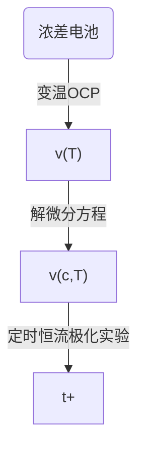
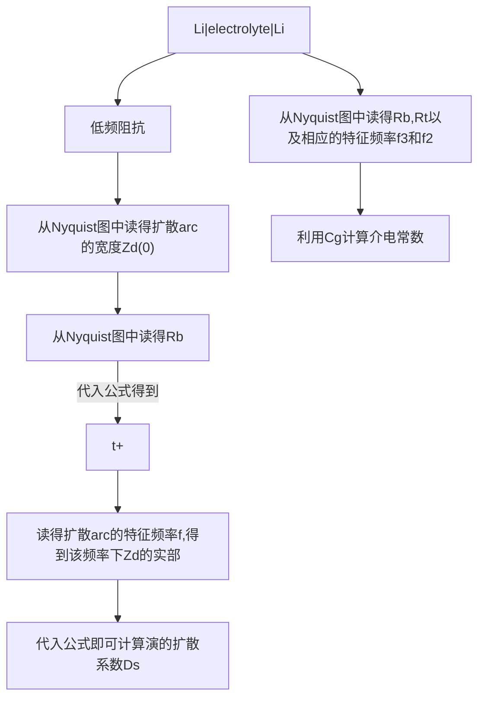
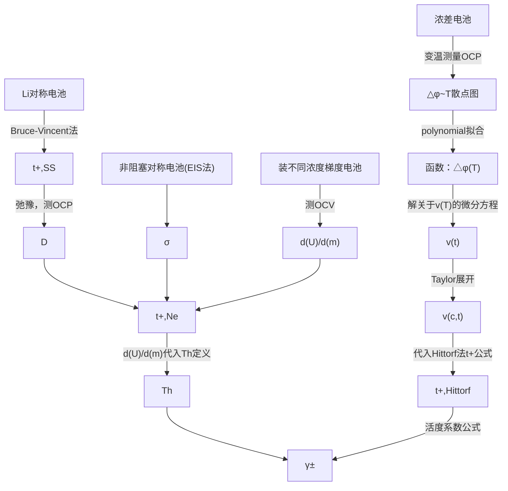

# Technical Memo 1# Transport Properties

------

Theme: Transport and transference in battery electrolytes

元テーマ：离子迁移数と扩散系数

Initial update: 2021/01/22

Update time: 2023/02/02 - ver. 4.1

*Zhong F.    U.Tokyo     601330948@qq.com*

------

[TOC]

# Li transference number

## 1   原理

迁移数：  $t_+\overset{def}{=}\frac{I_+}{I}$

其中，I+表示阳离子的迁移电流。I为总电流。需要注意的是，此定义使用与电解质中离子间不形成离子聚集体的情况。

**离子电导率的反映的是电解质中各种离子迁移能力的总和，而离子迁移数则是对电解质中某一种离子迁移能力的量度。**

假设一完美的体系，电流流动初始取决于电池的电导与电压差

$I_0 = \frac{\sigma}{k} \Delta V$

其中 $k=\frac{I}{S}$     (长度/面积）

施加一个很小的电压时（<10mV），达到稳态时，溶液浓度梯度不随时间变化。阳离子的电迁移正好被扩散所平衡

此时电流$I_{ss}$为：$I_{ss} = \frac{t_+ \sigma}{k} \Delta V$

易得：$t_+ = \frac{I_{ss}}{I_0}$（理想情况，忽略界面电阻，电解质完全解离。）

但以上只针对理想情况。

在真实体系中存在两个问题：

1. 存在界面阻抗，这些电阻也会随着时间和浓度的变化而变化。
2. 电解质并不完全满足Arrhenius公式，即并不是完全解离，存在诸如[LiX]的中性对，抑或是[Li~2~X]^+^或[LiX~2~]^-^。

------

## 2   方法

关于迁移数的测量方法，主要可以分为以下几种方法：

- Bruce-Vincent方法

- Tubandt方法

- 电动势法

- 交流阻抗法

- Doyle-Newman方法

- NMR法
  
  - PFG-NMR
  
  - E-NMR

---

### Bruce-Vincent方法

最常用的是Bruce-Vincent方法，但是它应用的前提条件是**稀溶液（完全电离）**，满足Arrhenius公式：$\sigma_i = \frac{\left|z_i\right|^2 F^2 c_i}{RT} D_i$

> More specifically, that the electrolyte obeys the Nernst-Einstein equation, which relates the conductivity (and the electrical mobility) of an ion to its diffusion coefficient.
> 
> Regardless of how carefully the experiment is set up, is that assumption of adherence to the Nernst-Einstein equation. This equation assumes that the ions do not interact with each other when they are dissolved, but this is only even approximately true in very dilute solution, for example concentrations **< 0.01 M.**

**过程：**

1. 施加一个很小的电压时（<10mV），得到初始电流与稳态电流。
2. 测量初始与稳态之后的电阻，理想情况下会得到这样的电阻：

其中Rs为电解质的离子阻抗（ionic resistance of electrolyte），Rp为界面电阻。

此时，初始电流为 $I_0 = \frac{\Delta V}{k/\sigma + R_{p,0}}$，稳态电流为 $I_{ss} = \frac{\Delta V}{k/t_+ \sigma + R_{p,ss}}$；利用$\sigma$相等换算公式为 $t_+ = \frac{I_{ss}\left(\Delta V - I_0 R_{p,0}\right)}{I_0 \left(\Delta V - I_{ss} R_{p,ss}\right)}$。这就是**Bruce-Vincent Equation**。

> **Ref**
> 
> 1. Evans, James et al. "Electrochemical Measurement Of Transference Numbers In Polymer Electrolytes". *Polymer*, vol 28, no. 13, 1987, pp. 2324-2328. *Elsevier BV*, doi:10.1016/0032-3861(87)90394-6. Accessed 22 Jan 2021.
> 2. Bruce, P., & Vincent, C. (1987). Steady state current flow in solid binary electrolyte cells. Journal Of Electroanalytical Chemistry And Interfacial Electrochemistry, 225(1-2), 1-17. doi: 10.1016/0022-0728(87)80001-3
> 3. Lacey, M. (2021). Transport and transference in battery electrolytes. Retrieved 22 January 2021, from http://lacey.se/science/transference/

对于不能完全解离的电解质，存在诸如[LiX]的中性对，抑或是[Li~2~X]^+^或[LiX~2~]^-^，先不论这些物质是否真实存在，移动一个正电荷带了两个Li^+^，所以，这些物质拥有他们自己的 t^+^，

对于此类体系，要区分 *transference number* （后文用 T）和  *transport number*（后文用t）。前者是指移动单位法拉电荷所需要的锂离子摩尔数。

> The *transference number* for lithium, for example, is defined as the **number of moles of lithium transferred *by migration* per Faraday of charge**

对于上述体系中，它们的关系为 $T_+ = t_{\text{Li}^+} + 2t_{[\text{Li}_2\text{X}]^+} - t_{[\text{LiX}_2]^-}$，其表述所有含锂物种在电解液中迁移的净transference。在理想体系中，没有ion association，*T^+^* = *t^+^*。

同样，T^+^+T^−^=1。值得一提的是T^+^或T^−^<0的过程理论上也存在。中性的[LiX]的扩散没有考虑在T^+^之中，但是其仍会扩散至低浓度区域。

注：利用实际上测定的是Bruce和Vincent称为"limiting current fraction"的参数 *F~+~*，该参数是否有意义仍在讨论。

***[Photo here] Fig.S6** in  **https://doi.org/10.1038/s41560-021-00783-z***

迁移数在论文中一个典型的图。（如果图片挂掉了，就在下面这篇文献的支持信息里找Fig.S6）

> Holoubek, J.; Liu, H.; Wu, Z.; Yin, Y.; Xing, X.; Cai, G.; Yu, S.; Zhou, H.; Pascal, T. A.; Chen, Z.; Liu, P. Tailoring Electrolyte Solvation for Li Metal Batteries Cycled at Ultra-Low Temperature. *Nature Energy* **2021**. https://doi.org/10.1038/s41560-021-00783-z.

**【注意】** 需要注意的是，用$t_+ = \frac{I_{ss}}{I_0}$ 这一定义得到的离子迁移数误差较大！主要原因在于没有考虑电极电阻对电流的影响。故下面的例子是很错误的：

> *The lithium-ion transference numbers were obtained by combining alternating-current (AC) impedance and direct-current (DC) polarization measurements using a symmetric Li/electrolyte/Li cell. First, AC impedance test was performed to obtain a total resistance Rcell. Then DC polarization was carried out to obtain a stable current IDC. The lithium-ion transference number was calculated by the formulas (tLi+=Rcell/RDC and RDC=VDC/IDC).*
> 
> *[reference]*
> 
> Suo, L., Hu, YS., Li, H. *et al.* A new class of Solvent-in-Salt electrolyte for high-energy rechargeable metallic lithium batteries. *Nat Commun* **4,** 1481 (2013). https://doi.org/10.1038/ncomms2513 
> 
> [A new class of Solvent-in-Salt electrolyte for high-energy rechargeable metallic lithium batteries | Nature Communications](https://www.nature.com/articles/ncomms2513)

为了修正这一误差，可以采用$I_\Omega$ 去代替$I_0$ 。

$I_\Omega = \frac{\Delta V}{R_{i,0}+R_{b,0}}$

transference number obtained using steady-state current method ($t_{+,SS}$)为：

$t_{+,SS} = \frac{i_{SS}(\Delta V-i_\Omega R_{i,0})}{i_\Omega(\Delta V-i_{SS} R_{i,SS})}$

其中，${R_{i,0}, R_{b,0}}$ 分别代表电池的 initial interfacial resistance ($\Omega \ cm^2$)和initial bulk resistance ($\Omega \ cm^2$)；${R_{i,SS}, R_{b,SS}}$ 分别代表电池的steady-state interfacial resistance ($\Omega \ cm^2$)和steady-state bulk resistance ($\Omega \ cm^2$)

一个典型的steady-state current experiment实验的弛豫时间为4h，极化$\Delta V = 10 mV,-10mV \ and\ 20 mV,-20mV$，多组极化的目的是为了确保离子传输特性与极化的正负号与大小无关。同时，每隔20min测一次EIS，微扰为10mV来最小化EIS测试对极化信号的干扰。

【注意】对称电池Pre-condition可以进一步排除表面对实验结果的影响。典型protocol为：0.02 mA/cm2电流密度，跑5个 charge/discharge cycles来得到稳定的界面。每一圈包括：4 h charge，45 min rest，4 h discharge。

【注意】$\frac{i_{SS}(\Delta V-i_\Omega R_{i,0})}{i_\Omega(\Delta V-i_{SS} R_{i,SS})}$也被称为 Steady-state cation current fraction (ρ+) ，即$t_{+,SS}=\rho_+$  (REF: Journal of The Electrochemical Society, 2022 169 020538)

> 1. Journal of The Electrochemical Society, 2022 169 020538
> 
> 2. Danielle M. Pesko et al. Negative Transference Numbers in Poly(ethylene oxide)-Based Electrolytes, **2017**, J. Electrochem. Soc.164, E3569

**测量真实迁移数的方法**

---

### Tubandt方法 (Hittorf method）

一定量的电荷通过电池，电解质被分为四部分。在聚合物电解质中更容易实现。需要装Hittorf电池。标准的Hittorf池子是四盐桥池。

中间两个参比区域的盐浓度需要一致。在电荷转移过程中，电场将阴离子或者阳离子迁移至电极表面，如果此过程由于在参比区域中形成的浓度梯度而使阴阳离子在过程中停了下来，那么来到电极表面的阴阳离子的转移只可能是电迁移所致的，而非扩散。

此方法不需要电解质满足一定的前提条件。可以适用于高浓。

其计算公式为： $T_- = \frac{-\Delta \text{moles}_\text{Li} F}{Q}$。故如果能确定各区域中的盐浓度，即可计算T~+~与T~-~。

> Bruce, P., Hardgrave, M., & Vincent, C. (1992). The determination of transference numbers in solid polymer electrolytes using the Hittorf method. *Solid State Ionics*, *53-56*, 1087-1094. doi: 10.1016/0167-2738(92)90295-z

这里引入一种改良Hittorf方法，是Moli公司所推出的浓差Hittorf法：

【注意！】这里的Hittorf法做了一定的简化，并有前提条件，因此并不能算严格意义上的精准测量！

***Prerequisite***   忽略盐的扩散；盐桥两边的对流被完全阻断。

【此处有图】Fig.2

***Theory***

$$
\Delta c_{anode}=\frac{\Delta n}{V_{anode}}=t_- \frac{q}{V_{anode} F}=(1-t_+)\frac{It}{V_{anode}F}
\\
\Delta c_{cathode}=-\frac{\Delta n}{V_{cathode}}=-t_+ -\frac{q}{V_{cathode} F}=(t_+-1)\frac{It}{V_{cathode}F}
\\
\Delta c=\Delta c_{anode}-\Delta c_{cathode}=\frac{It(1-t_+)}{F} \frac{V_{cathode}+V_{anode}}{V_{cathode}V_{anode}}
$$

其中，V_anode为阳极电解液体积（一般认为阳极室体积），$\Delta n$为阳极室物质量的变化。q是总电量=It。

故可推出：

$$
t_+=1-\frac{V_{cathode}V_{anode}}{V_{cathode}+V_{anode}} \cdot \frac{F\Delta c}{It}
$$

利用电势与浓度的关系：$d\Phi =\frac{2RT}{F}\cdot \upsilon(c,T)\ d\ ln\ c$（详细推导见Newman方法的γ部分），有：

$$
t_+=1-\frac{V_{cathode}V_{anode}}{V_{cathode}+V_{anode}} \cdot \frac{F^2\Delta \Phi}{2ItRT} \cdot \frac{c_0}{\upsilon(c,T)}
$$

其中，$c_0=\frac{c_R+c_L}{2}$，具体的v(c,T)也在后面的newman方法中有记载。

在求得v(c,T)后，$\Delta \Phi,I,t$通过恒流极化获得。

【注意！】一定要避免过大的极化，即$\Delta \Phi$值。因为这一极化越大，需要的v(c,T)的Taylor展开项的项数就越多，才能获得准确的$\Delta c$。

实验设定是变温OCP检测。流程图如下：

定时恒流取初始的线性扩散区。

后续关于$\gamma_\pm$的求解流程图并进了newman章节后面的流程图里。

> Journal of The Electrochemical Society, 152 (5) A882-A891 (2005)

---

### 电动势法

下次再更。

> Bourish A, Dalard F, Deroo D, Armand M B. J Appl Electrochem, 1987,17:625.
> 
> Bourish A, Dalard F, Deroo D, Armand M B. J Appl Electrochem, 1990,20:1040.

---

### 交流阻抗法

构筑电池：

M(s)|电解质|M(s)

等效电路如参考文献Fig.2所示

【此处应该有图】

交流阻抗谱图如参考文献Fig.1所示。

【此处应有图】

其中：

Rb——电解质阻抗

Cg——几何电容 (At very high frequencies there is a capacitive coupling between the electrodes (the geometrical capacity)

Rt——电荷界面反应电阻

Cdl——双电层电容

Zd——扩散阻抗

> **Zd最后又与实轴相交的原因**
> 
> At very low frequencies the amount of charge transferred in the electrode reactions during half a cycle is sufficient to produce concentration gradients in the electrolyte. In the impedance plots this is reflected in the linear part of arc 1 having a slope of 1. 
> 
> At still lower frequencies concentration waves and quasisteady state profiles may develop, depending on the thickness of the electrolyte. 
> 
> This causes the cell impedance to return to the real axis as shown in Fig. 1(d).

***Theory***

$Z_d=R_b\frac{\mu_2}{\mu_1}\frac{tanh\ \alpha}{\alpha}$

其中，$\alpha^2 \overset{def}{=}\frac{j2\pi fl^2}{D_s}$，是一个与频率、电解质厚度和盐扩散系数有关的量

迁移数的核心公式仍为：$t_1=\frac{\mu_1}{\mu_1+\mu_2}=\frac{1}{1+\frac{\mu_2}{\mu_1}}$

当$f\rightarrow0$ 时，$\alpha \rightarrow 0$，$Z_d(0)=R_b\frac{\mu_2}{\mu_1}$，带入有：

$t_1=\frac{1}{1+\frac{Z_d(0)}{R_b}}$

对于此式，$Z_d(0)$为低频扩散arc的宽度，可以通过实验测出，不过一般频率要很低才会观察到扩散阻抗重新交于$Z_{re}$实轴，参考文献中扩散arc的特征频率是$1.6 \times10^{-3} Hz$，低频区一直测到了$10^{-4} Hz$的量级。

当α比较大使tanh(α)=1时，由Zd的定义，可以得到盐的扩散系数 $D_s=(\frac{Re[Z_d]}{Z_d(0)}l)^2 4\pi f$，需要说明的是Re[Zd]是在频率f下Zd的实部。

另，当f3和f2得到之后（Nyquist图半圆顶点），可以利用下述公式计算Cg与Cdl。

$R_b C_g f_3 2 \pi=1$

$R_t C_{dl} f_2 2 \pi=1$

Cg本身则是与介电常数有关，即 $C_g=\frac{\epsilon \cdot A}{l}$，故可从Cg反推出介电常数（针对polymer complex，是否能推广到液态电解液中我尚未查证）。

这里给到一个相关流程与待测量关系的flowchart：

<mark>**使用这一方法的关键点在于测得极低频率阻抗与与实轴相交的扩散arc**</mark>

***Terms***

其中：t1同t+，μ1同μ+，μ2同μ-，μ1和μ2分别是阳离子与阴离子的迁移速率（ionic mobility）

Zd(0) ——当频率接近0时，Zd的值

$\epsilon$ —— dielectric constant of the electrolyte

l ——thickness of the electrolyte

A ——电解质面积

f ——频率

    f2,f3 ——Cg和Cdl的特征频率

Ds ——盐的扩散系数 salt diffusion coefficient

> 主要ref：Ravn Sørensen, P.; Jacobsen, T. Conductivity, Charge Transfer and Transport Number—an AC-Investigation of the Polymer Electrolyte LiSCN-Poly(Ethyleneoxide). *Electrochimica Acta* **1982**, *27* (12), 1671–1675. https://doi.org/10.1016/0013-4686(82)80162-X.
> 
> 次要ref：Macdonald, J. R. Simplified Impedance/Frequency‐response Results for Intrinsically Conducting Solids and Liquids. *J. Chem. Phys.* **1974**, *61* (10), 3977–3996. https://doi.org/10.1063/1.1681691.

---

### Doyle-Newman方法 (==Full characterization of eletrolyte transfer properties==)

Doyle-Newman方法及Newman方法（John Newman，yyds），是complete characterization of transport properties的核心。其是测定t+的**准确**方法，不依赖任何理想条件假设。

由于Newman法测定t+涉及到其他的传输参数测定，这里直接整合complete characterization，包括σ、D、Th的测定。

#### 1. t+,Ne（Newman法测得的t+）

**Theory**

$Ne \overset{def}{=}a \frac{\sigma RT(1-t_{+,Ne})^2}{F^2 D c}(1+\frac{d\ ln(\gamma_\pm)}{d\ ln(m)})$

$\frac{i_{SS}}{i_0}=\frac{1}{1+Ne}$

式中各项参数定义为：

R，T——气体常量与温度(K)

F——Faraday常量

c——电解质主体的浓度(bulk concentration of electrolyte)

**a——关于盐的化学计量学的参数，对于诸如LiTFSI的单价(monovalent)盐来说，a=2**

$T_h \overset{def}{=} 1+\frac{d\ ln(\gamma_\pm)}{d\ ln(m)}$，热力学因数（Thermodynamic factor），量化平均摩尔活度系数对溶液摩尔浓度的变化（quantifies the change in the mean molal activity coefficient of the salt, γ±, with the molality, m, of the solution）。

γ±——平均摩尔活度系数（mean molal activity coefficient of the salt）

m——溶液的摩尔浓度（molality）

【注意】Ne定义式中右边的项都是正数，所以得到的t+介于0~1之间。如果测出了在此范围外的值，一般是由于副反应引起的。（本文档中另作讨论）

由上述公式可知，要得到 t+,Ne，需要测得$\frac{i_{SS}}{i_0},\sigma,D,T_h$ 四个参数。

接下来各选一种代表性方法得到以上参数（$\frac{i_{SS}}{i_0},\sigma,D,T_h$）。其中$\frac{i_{SS}}{i_0}$即$t_{+,SS}$，还是用steady-state current experiment来测，同改进的Bruce-Vincent法（即使用包含$I_\Omega$的$t_{+,SS}$公式，这里不做赘述。）

#### 2. σ

采用阻抗法得到。或者电导仪得到。此处略去不谈。详细记录在关于电导率的文档里。

#### 2.5 t+,ss

还是Bruce-Vincent法，详见上面。

$$
I_\Omega = \frac{\Delta V}{R_{i,0}+R_{b,0}}
\\
t_{+,SS} = \frac{i_{SS}(\Delta V-i_\Omega R_{i,0})}{i_\Omega(\Delta V-i_{SS} R_{i,SS})}
$$

#### 3. D

使用restricted diffusion measurement。通过稳态电流实验（steady-state current experiment）实现。

**【注意】此实验应在$t_{+,SS}$ 的steady-state current试验之后做。这样可以利用之前施加的$\Delta V$ 作为初始极化。**

核心：施加一个电压，然后撤掉，记录开路电压对时间的弛豫曲线。然后微分处理。

利用公式：

$-\frac{d\ ln\ U}{d\ t}=\frac{\pi^2 D}{L^2}$

其中，L为电解质的厚度，U为OCP。这里的$\frac{dlnU}{dt}$往往是创造函数 U(t) 去拟合出来的。典型函数为polynomial函数 $U(t)=k_0+k_1 e^{-k_2t}$。于是就有$D=\frac{L^2 k_2}{\pi^2}$

在实际操作中，可以舍弃掉t=0~5 min的数据（在测量扩散之前让双电层完全放电，排除影响）。典型的t值为2h。

#### 4. t+,Ne与Th

综合$t_{+,SS}=\frac{i_{SS}}{i_0},\frac{i_{SS}}{i_0}=\frac{1}{1+Ne}$以及Ne的定义，可得：

$$
t_{+,Ne}=1-\sqrt{\frac{\frac{F^2 D c}{a \sigma R T}(\frac{1}{t_{+,SS}}-1)}{(1+\frac{d\ ln\ \gamma_\pm}{d\ ln\ m})}}
$$

可以发现，要求解t+,Ne需要知道Th。

由于：

$T_h \overset{def}{=} 1+\frac{d\ ln(\gamma_\pm)}{d\ ln(m)}$

根据Newman的理论，有

$1+\frac{d\ ln(\gamma_\pm)}{d\ ln(m)}=-2\cdot \frac{F}{RTt_-}(\frac{d\ U}{d\ ln\ m})$，这里的2其实是由$\frac{z_+ v_+}{v}$得到的。其实更为泛用的表述为：

$$
T_h=1+\frac{d\ ln(\gamma_\pm)}{d\ ln(m)}=-\frac{z_+ v_+}{v} \frac{F}{RTt_-}(\frac{d\ U}{d\ ln\ m})
$$

可以看到这里的Th的求解需要先得到迁移数。

所以，将Th代入$t_{+,Ne}$的表达之中，可以得到：

$$
t_{+,Ne}=1+(\frac{1}{t_{+,SS}}) \cdot \frac{z_+ \upsilon_+}{\upsilon } \cdot \frac{aFDc}{\sigma} \cdot (\frac{d\ ln(m)}{d\ U})
$$

所以可以求出$t_{+,Ne}$，随后可得Th。

这里面的第一步是要得到$\frac{d\ U}{d(ln\ m)}$。

这里的实验是通过配置不同摩尔浓度的电解液，测OCV，并拟合出$U[ln(m)]$，即U关于ln(m)的关系。

这里同样也是较多用polynomial函数，典型值为$U=0.03913-0.04095 [ln(m)] -0.01832 [ln(m)]^2 −0.00184[ln(m)]^3$

得到这一关系后，可以带入$t_{+,Ne}$表达中，于是有

$t_{+,Ne}=f([t_{+,SS},D,\sigma];[c,m])$

c——盐浓度，mol/L

**m——molality，单位 mol/kg**

得到这$\frac{d\ U}{d\ ln\ m}$和$t_{+,Ne}$后，便可得到Th。

得到Th后，可以反过来利用Th的定义去求活度。

> Nitash P. Balsara and John Newman. Relationship between Steady-State Current in Symmetric Cells and Transference Number of Electrolytes Comprising Univalent and Multivalent Ions. 2015 *J. Electrochem. Soc.* 162 A2720 https://iopscience.iop.org/article/10.1149/2.0651514jes

#### 5. $\gamma_\pm$

延续上述的实验得到得到这 $\frac{d\ U}{d\ ln\ m}$ 和 $t_{+,Ne}$ 后，代入：

$$
1+\frac{d\ ln(\gamma_\pm)}{d\ ln(m)}=-\frac{z_+ v_+}{v} \frac{F}{RTt_-}(\frac{d\ U}{d\ ln\ m})
$$

积分可得 $\gamma_\pm$ 与 m 的关系。当 m 确定时，活度系数也确定了。进一步得到活度采用，$\gamma = \frac{a}{c}$ 得到。

这里还可以从另一个角度出发，得到活度。

另一种角度的基本公式为

$$
d \Phi = \frac{2RT}{F} \cdot (1-t_+) \cdot d\ ln(\gamma_\pm c)
$$

右边可以处理为：

$\frac{2RT}{F} \cdot (1-t_+)\cdot (1+\frac{d\ ln\ \gamma_\pm}{d\ ln\ c})\cdot d\ ln\ c$

（注意这里将$d\ ln \frac{c}{c_0} \rightarrow d\ ln\ c$，因为是微分，所以可以得到结果是相同的）

需要注意的一点是这里求得的$\gamma_\pm$ 为平均摩尔活度系数（mean molar activity coefficient）

下面进行一些数学上的处理：

首先，令 $\upsilon(c,T) \overset{def}{=} (1-t_+)(1+\frac{d\ ln\ \gamma_\pm}{d\ ln\ c})$

根据Debye-Hückel定律，当c→0时，有：

$\frac{\partial\ ln\ \gamma_\pm}{\partial \ ln\ c} \approx -A\frac{1}{2}c^{\frac{1}{2}}+constant(c)$

$\lim_{c \rightarrow 0}\frac{\partial \gamma_\pm}{\partial c}=0$

A为常数，与溶剂的介电常数有关。

为了更加准确的描述真实行为，对$\upsilon(c,T)$进行Taylor展开：

$\upsilon(c,T)=\upsilon_0(T)+\upsilon_1(T)c^{\frac{1}{2}}+\upsilon_2(T)c^1 \cdots = \sum_{i=0}^n \upsilon_i(T)c^{\frac{1}{2}}$

代入$d\Phi$的表达式中，积分，得到：

$$
\int^{R}_{L}d\Phi \cdot \frac{F}{2RF}= \frac{\Delta\Phi F}{2RT}
\\
=\upsilon_0[ln\ c]_{c_L}^{c_R}+\sum_{i=1}^n \upsilon_i(T) \frac{2}{i} [c^{\frac{i}{2}}]^{c_R}_{c_L}
\\
=\upsilon_0(T)[ln\ c_R-ln\ c_L]+2\upsilon_1(T)[ln\ c_R^{\frac{1}{2}}-ln\ c_L^{\frac{1}{2}}]+\upsilon_2(T)[c_R-c_L]+\upsilon_3(T)\frac{2}{3}[c_R^\frac{3}{2}-c_L^\frac{3}{2}] \cdots
$$

其中$c_L,c_R$分别是左侧和右侧的盐浓度。需要注意的是v(c,T)不是与δC的函数，而是c的函数。

故$\upsilon_i(T)$可以通过$\Delta\Phi(T),c_L,c_R$来进行拟合得出。

具体操作为：将浓差电池在不同温度下测OCP，然后拟合出$\Delta\Phi(T)$，然后根据$\frac{\Delta\Phi F}{2RT} =\upsilon_0[ln\ c]_{c_L}^{c_R}+\sum_{i=1}^n \upsilon_i(T) \frac{2}{i} [c^{\frac{i}{2}}]^{c_R}_{c_L}$这一式子去解关于$\upsilon(T)$的微分方程。

解出$\upsilon(T)$后，带入Taylor展开式$\upsilon(c,T)= \sum_{i=0}^n \upsilon_i(T)c^{\frac{1}{2}}$中即可得到$\upsilon(c,T)$

得到t+与v(c,T)后，利用以下公式推出活度系数。

$$
ln \gamma_\pm=\frac{1}{1-t_+} \sum^{n}_{i=1} \frac{2}{i} \upsilon_i(T) c^\frac{i}{2}
$$

并且有$\upsilon(c,T)$后，可得到在特定温度下的OCP~c的关系。随后代入进前文改良Hittorf法的公式中，即可得到迁移数。（公式在Hittorf法的章节末尾，即$t_+=1-\frac{V_{cathode}V_{anode}}{V_{cathode}+V_{anode}} \cdot \frac{F^2\Delta \Phi}{2ItRT} \cdot \frac{c_0}{\upsilon(c,T)}$）

关于Doyle-Newman法，以及相关的transport properties全表征，有流程图：

#### 6. 关于误差

此处应有误差分析...（但我懒，先不写了）

---

### NMR方法

#### FPG-NMR

FPG-NMR即脉冲场梯度NMR（pulsed-field gradient NMR experiment）。其本质是利用NMR测得自扩散系数（利用自旋回旋波的振幅M与自扩散系数D的指数关系，M=f(D)。），随后利用理想溶液（完全解离假设）的迁移数公式得到迁移数。即：

保持$\Delta$（两个梯度脉冲之间的时间）和$\delta$（场梯度脉冲宽度）的不变，则有$M=C\cdot e^{-r^2 g^2 \delta^2 D_s (\Delta-\frac{\delta}{3})}$

$t_{+,NMR}=\frac{D_{Li}}{D_{Li}+D_{F}}$

第一个公式各参数见后面的例子。使用第二个公式的前提条件则是，电解质的自扩散系数与迁移率符合Einstein关系。故对于非理想电解质，即盐浓度较高时，此公式不准确！

> **典型实验步骤**
> 
> Electrolytes were placed into NMR tubes and sealed with high pressure polyethylene caps before measurement. NMR measurements were performed on a Bruker Avance 600 MHz instrument fitted with a Z-gradient direct detection broad-band probe and a variable temperature unit maintained at 90◦C throughout the experiments. Measurements were performed on the isotopes of 7Li and 19F to probe the diffusion of lithiated and fluorinated salt species, respectively. All samples produced peaks around 233 MHz for lithium and 565 MHz for fluorine corresponding to all lithium- and TFSI-containing ions. The 90° pulse lengths were optimized for each sample to achieve maximum signal amplitude. T1 relaxation times were independently measured for each sample nuclei using inversion-recovery (180-τ-90-acq.) to insure the choice of an appropriate diffusion time interval, $\Delta$. A bipolar gradient pulse sequence was used to measure the self-diffusion coefficients, Di. 
> 
> The attenuation of the echo E was fit to, 
> 
> $E=e^{-r^2 g^2 \delta^2 D_i (\Delta-\frac{\delta}{3})}$
> 
> where
> 
> γ is the gyromagnetic ratio, 
> 
> g is the gradient strength, 
> 
> δ is the duration of the gradient pulse, 
> 
> $\Delta$ is the interval between gradient pulses, 
> 
> $\tau$ is the separation between pulses, and
> 
> $D_i$ is the self-diffusion coefficient. 
> 
> Parameters used for acquisition were diffusion intervals  $\Delta$= 0.55 to 0.85 s (7Li) and 0.96 to 1.2 s (19F), and pulse lengths δ = 5 to 10 ms (7Li) and 1 to 2.5 ms (19F). 
> 
> For each diffusion measurement, 32 experiments of varying gradient strength were performed, and the change in amplitude of the attenuated signal was fit to obtain the parameter Di. All measured signal attenuations were single exponential decays, and R2 values for all fits were greater than 0.99 for both 19F and 7Li. Only one data point was collected for each r value, because of the complexity and length of the PFG-NMR measurements at slow diffusion times.
> 
> *Journal of The Electrochemical Society, 164 (11) E3569-E3575 (2017)*

#### E-NMR

电泳NME即ENMR。虽然也是用脉冲梯度来探讨分子运动，但同步电场脉冲回波实验中，E-NMR采用相位标记核的位置，由信号的相位移（$\phi$）定核的迁移率，故其本质是改良版的Hittorf法。其核心公式为

$\phi=\gamma \delta\Delta g \frac{I}{cFA}T_+$

A——样品截面积

c——盐浓度

得到φ与I的斜率即可求得T+。这是一种准确方法。

> Dai H, Zawodzinski T A. J Electrochem Soc, 1996,143: L107
> 
> Dai H, Zawodzinski T A. J Electrochem Soc, 1998,143459: 111

> Quantifying Mass Transport during Polarization in a Li Ion Battery Electrolyte by in Situ 7Li NMR Imaging. (2021). Retrieved 22 January 2021, from https://pubs.acs.org/doi/10.1021/ja305461j

# Li diffusion number

## 测量

### 1、利用循环伏安法测量表观扩散系数

依据：Randles-Sevcik方程

$$i_{p}=0.4463\ nFAC\left({\frac {nFvD}{RT}}\right)^{\frac {1}{2}}$$

Or if the solution is at 25 °C:[[2\]](https://en.wikipedia.org/wiki/Randles–Sevcik_equation#cite_note-2)

可逆体系：$$i_{p}=(2.69\times 10^{5})n^{\frac{3}{2}}AD^{\frac {1}{2}}Cv^{\frac{1}{2}}$$

不可逆体系：$$i_{p}=(2.99\times 10^{5})n(\alpha n_\alpha) ^{\frac{1}{2}}AD^{\frac {1}{2}}Cv^{\frac{1}{2}}$$

- *i~p~* = current maximum in amps
- *n* = 转移电子数 number of electrons transferred in the redox event (usually 1)
- *n$_\alpha$* = 速控步的反应电子数，近似处理时，*n$_\alpha$=n*
- *A* = 电极面积 electrode area in cm2
- *F* = [Faraday Constant](https://en.wikipedia.org/wiki/Faraday_constant) in C mol−1
- *D* = diffusion coefficient in cm2/s
- *$\alpha$* = 交换系数，对于完全不可逆，$\alpha$=0.5
- *C* = 锂离子浓度 concentration in mol/cm3
- *ν* = 扫速 scan rate in V/s
- *R* = [Gas constant](https://en.wikipedia.org/wiki/Gas_constant) in J K−1 mol−1
- *T* = temperature in K

### 2、利用EIS测量表观扩散系数

> https://mp.weixin.qq.com/s/xVDlOVQf_kntaDoGSM7o1g
>
> https://en.wikipedia.org/wiki/Randles%E2%80%93Sevcik_equation