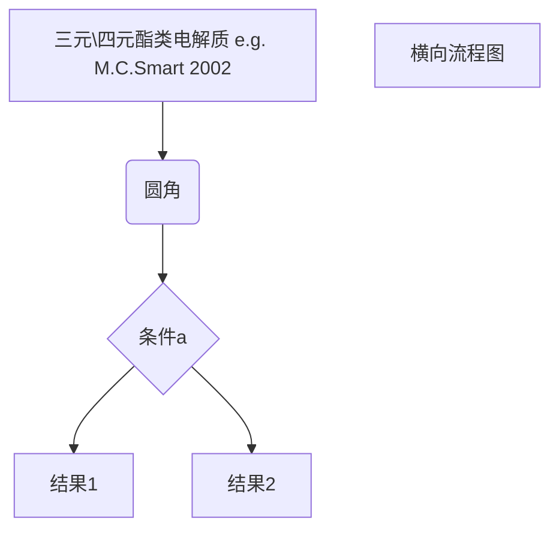

# 电解质梳理

电解质梳理

**DOCUMENT INFO**

***

> _**电解质梳理**_
>
> _Zhong F. U.Tokyo_
>
> _601330948@qq.com_

***

## _TOC_

\[TOC]

## 概述

#### 电解质要求

1. 电导率
2. 稳定性（电化学、化学）
3. 宽温
4. 相容性（SEI和CEI可以有效生成）
5. 安全性

#### 构造

* 溶剂（solvent）：溶解分散锂盐
  * ether-based electrolytes
  * ester-based electrolytes
* 共溶剂（co-solvent）
* 添加剂（addictive）：提升性能，如宽展温度范围，辅助成膜等
* 锂盐

#### 按照体系分类

* 固体电解质
* 水系电解质
* 有机电解质

#### 研究电解质时，需要关注的**性质**

***

**物理性质**

**导电性：以-40℃的EC/DMC/EMC=1:1:1为例，离子导电性为1mS/cm。**

**Li^+^与溶剂化**

分为对锂盐的解离度——溶剂极性（dissociation）、对Li+的溶剂方式（即溶剂化结构）（solvation）、对Li+的传输速度（transportation）

1.  **对锂盐的溶解度**

    **溶剂化/分散\*\*（dielectric effect——ion pairing）\*\***

    ​ 中心参数：介电系数（dielectric constant；dielectric permittivity）；要求高介电系数。\*【反应一个电信号在材料中的传输的速度，介电常数越大说明传输速度越慢，在真空中传输最快（Lange's handbook of chemistry, 16th ed.）】\*其决定粒子是否可以很好的分散（dissociation）、电荷迁移数t（又称电流分数，charge transfer number，表示其导电份额占多少）

    ​ 高介电常数可以很好的溶解锂盐。

    ​ 溶剂分子的极性大小与介电常数有关。介电常数是指当介质在外加电场时会产生感应电荷而削弱电场，原外加电场（真空中）与最终介质中电场比值为介电常数。介电常数越大，极性越强；反之则越小。

    ​ 介电常数是物质对电场的负反馈，宏观上测量结果是让溶液中电场减小。以下讨论不包含电介质的电极反应。

    ​ 对于弱电场，溶液中极性分子克服分子间作用力发生转动，改变自身偶极矩朝向。

    ​ 对于中等强度电场，溶液中部分离子会发生平动，电极附近溶液极化，生成双电层结构。

    ​ 对于超强电场，分子电子云发生极化变形，进一步增强分子偶极矩。

    ​ 对于极限强电场，分子结构被破坏

    > https://www.zhihu.com/question/363493480/answer/954235584

    ​ 我认为这其中溶剂的极性可以分为两部分，一部分是由于分子本身对称性所带来的本身的极性，另一部分来自电场的诱导。其中，对于溶剂化结构而言，分子自身的极性占据主要部分。
2. **溶剂化结构（Solvation Structure）**
3. **传输**

**迁移过程\*\*（viscosity effect）\*\***

​ 中心参数：黏度（viscosity）；要求低黏度。【黏度本质是分子之间的引力：温度降低，分子间距减小，粘性升高】——离子运动（ion mobility）

**凝固点、沸点之类**

* Tm测试方法：DSC

**黏度**

VTF方程( **Vogel-Fulcher-Tammann equation**)：描述温度与黏度的关系\*\*（$\eta$\~$e^{-T}$）\*\*

公式：

$$\eta=\eta_0\cdot e^\frac{B}{T-T_{VF}}$$

其中，B和$\eta\_0$是与材料相关的经验参数，而$T\_{VF}$是经验拟合参数，通常在比玻璃化转换温度小50$^\circ C$。

VTF模型尚有如下的局限性:

1. VTF理论认为离子迁移是在均相的非晶态介质中发生的，只适用于在研究的温度范围内聚合物熔点之下有晶相聚合物，甚至有晶相复合物存在的电解质中的离子传输行为；为了使VTF方程满足由聚合物—盐非晶态复合物与晶相复合物构成的复杂体系，T0可以使用下式来近似计算其值：式中，Wi和Ti分别是聚合物和晶相复合物的质量分数和玻璃化转变温度。
2. 没有考虑离子缔合作用而引起的载流子数量变化的情况。
3. VTF方程描述的是聚合物链段的运动而不是对电导率起重要作用的阴、阳离子的运动。

> 1. https://en.wikipedia.org/wiki/Vogel-Fulcher-Tammann\_equation
> 2. L. S. García-Colín, L. F. del Castillo, and Patricia Goldstein Phys. Rev. B **41**, 4785 (1990) https://doi.org/10.1103/PhysRevB.40.7040
> 3. http://www.juda.cn/blog/524.html

**Einstein关系**

在分子运动论中，**爱因斯坦关系**是一个以前没有想到的关系，由爱因斯坦在1905年和Marian Smoluchowski在1906年独立发现。该方程是涨落耗散定理（英语：Fluctuation-dissipation theorem）的一个早期的例子。它在电致扩散的现象中经常使用。

$$D=\mu_p k_B T$$

$\mu\_p$=$\frac{v\_d}{F}$——粒子迁移率（$v\_d$：粒子终极速度，F：作用力）

$ k\_B$——Boltzmann常数

$ T$——绝对温度

**Stokes定律**

在雷诺数很小的情况下，有斯托克斯定律：

$$F_d=6\pi\eta r V$$

> 其中：
>
> $F\_d$——球形物体在流体中运动所受到的阻力
>
> $\eta$——流体的粘度
>
> r——该球形物体的半径
>
> V——速度

若物体在流体中由于自身的重量而下落，则其最终速度为

$$V_s=\frac{2}{9}\cdot\frac{r^2g(\rho_p-\rho_f)}{\eta}$$

**Einstein-Stokes关系——粒子的扩散**

在低雷诺数（Re）的极限下，$$\mu \approx \frac{1}{\gamma}$$（迁移率$\mu$ 是阻力系数$\gamma$ 的倒数）。对于半径为 r 的球形粒子，Stokes定律给出：

$$\gamma=6\pi \eta r$$

> $\eta$——介质的黏度
>
> $\gamma$——阻力系数
>
> $\mu$——迁移率

代入$$D=\mu_p k_B T$$有

$$D=\frac{k_B T}{6\pi\eta r}$$

这个方程也称为**斯托克斯-爱因斯坦关系**或**斯托克斯-爱因斯坦-萨瑟兰方程**\[[1\]](https://www.knowpia.cn/pages/%E7%88%B1%E5%9B%A0%E6%96%AF%E5%9D%A6%E5%85%B3%E7%B3%BB#cite\_note-1)。它可以用于估计球状蛋白在水溶液中的扩散系数。

**电传导**

当应用于电传导的时候，通常把电迁移率定义为机械导纳$\mu\_p$与载流子的电荷_q_的乘积：

$$\mu_q = \mu_p \cdot q$$

也可以表述为：

$$\mu_q = \frac{v_d}{E}$$

> $\mu\_p$——机械导纳
>
> q——电荷
>
> $$v_d$$——
>
> E——施加的电场

$$D=\frac{\mu_q k_B T}{q}$$

注：对于在任意态密度的半导体中，爱因斯坦关系为 $$D=\frac{\mu_q p}{q\cdot \mathrm{d}p/\mathrm{d}\eta}$$ ，其中$\eta$ 为化学势，p为粒子数。

> 1. \*\*[^](https://www.knowpia.cn/pages/%E7%88%B1%E5%9B%A0%E6%96%AF%E5%9D%A6%E5%85%B3%E7%B3%BB#cite\_ref-1)\*\*http://www.physics.emory.edu/\~weeks/lab/papers/sendai2007.pdf
> 2. "Fluctuation-Dissipation: Response Theory in Statistical Physics" by Umberto Marini Bettolo Marconi, Andrea Puglisi, Lamberto Rondoni, Angelo Vulpiani, \[1]
> 3. https://www.knowpia.cn/pages/%E7%88%B1%E5%9B%A0%E6%96%AF%E5%9D%A6%E5%85%B3%E7%B3%BB
> 4. https://www.knowpia.cn/pages/%E6%96%AF%E6%89%98%E5%85%8B%E6%96%AF%E5%AE%9A%E5%BE%8B

On Solvation Structure

**What is solvation structure？**

溶剂化结构是指Li^+^与阴离子、溶剂、共溶剂之间产生相互作用力，形成的一种分子结构。

典型的溶剂化结构（常规浓度电解液）可以分为两层，内层为第一溶剂鞘，外层为第二溶剂鞘。溶剂鞘内包含溶剂分子，锂盐解离出的阴离子分散在整个电解液之中。

**Where does solvation structure form？**

针对嵌入脱出电极，溶剂化结构，在充电时，Li^+^从正极脱出，在电极与电解液界面处与自由溶剂形成溶剂化结构，并放出能量，这个能量称为溶剂化能；Li^+^进入负极，在负极表面脱除溶剂化结构，需要吸收能量，称为脱溶剂化能。

* Li^+^的能量情况在这个过程中是怎么样的，它是否受到电极整体能量的影响？
* SEI与电极界面之间是否存在参与完整溶剂分子？这些溶剂分子是对Li^+^的迁移是否有影响？
* 在新鲜电极上（无SEI）的溶剂化过程与在SEI上的溶剂化过程是否有区别？

**How is the solvation structure moves?**

溶剂化结构在电解液中是一个动态的过程，存在一个寿命；在电极表面，Li+脱溶剂化，进入电极，极性溶剂分子会分离出来，由于电极表面带负电，部分分子会不可避免的与电极表面接触发生电子交换，发生反应，生成保护性薄膜。当溶剂鞘中有较多阴离子时，就可以得到阴离子的分解产物。这些产物多半是含F的，可以对SEI有好处。

Stability

Solubility

Stable potential window

Freezing/boiling point

Solvation energy

Solvation structure

Ionic conductivity

Viscosity

***

**化学性质**

* 与电极的反应性
* ### 与集流体的反应性（Al、Cu）
* 成膜性能
  * 稳定电化学窗：即与阳极的还原反应电位进行比较，如果小于阳极的还原反应电位，电解质则会与阳极电极材料反应形成SEI。
    * 如果阳极的电化学势高于电解质的LUMO，则电解质在阳极上被还原。
    * 如果阴极的电化学势低于电解质的HOMO，则电解质在阴极上被氧化。
  * SEI的性能
    * 成分与厚度、紧密度
* 稳定性
  * 电化学稳定性：在几V的电压下会被氧化或者还原
  * 热稳定性：在多少度下会有热分解
* 影响这些性质的因素
  * 电解质、锂盐、添加剂**浓度**

***

#### 应用

**能承受高电压的电解质（5V-class）**

**高温电解质**

***

**低温电解质**

**常用的用于低温的电解质分类/A chronology**

* fluorinated ester
* EA
* GBL
* liquified gas
* ether
* plastic crystal
* aqueous electrolyte

**低温电解质所面对的问题**

* 低温对反应本身的影响：反应动力学变慢（sluggish reaction kinetics）
* 低温对体系的影响
  * 低温对电解质性质的影响：
    * 扩散较慢（slow diffusion）：在活性物质中Li+的扩散系数（diffusion coefficient）变小了
    * 电解质导电性变差（reduced ionic conductivity）（对电子迁移影响不大，对离子迁移影响较大）
  * 低温对界面以及电极的影响
    * SEI阻抗增加（对SEI的形貌有影响）；**Rct**增加，构成低温下的dominate resistance。其为Li+正在SEI中传输，包括Li+的脱溶剂化与Li+在SEI中的传输。
    * 扩散较慢（slow diffusion）：在活性物质中Li+的扩散系数（diffusion coefficient）变小了

**离子导电率**

* solvation/desolvation（LIB的决速步，目前没有办法将Li+的脱溶剂化过程与其在SEI中的传输分开研究。）
* dissociation
* transportation
  * 在bulk electrolyte中的传输
  * 在电极-电解质界面的传输
  * 在电极中的传输

**改善措施**

* 改善电解质配方：formulation与addictives
* 混合电解质与超级电容器
* 外部/内部加热方式：通过加热使电池电解质在一个可接受的温度范围内工作。

5.

## 电解质的表征与经典研究方法

此部分另成文档

***

***

***

***

This interlude was saved.

***

***

***

***

## 电解质

### 1 溶剂类

溶剂一般可以分为三类：

1. 质子溶剂（甲醇、乙醇、乙酸之类；含较强的质子氢，一般不适用于锂电池）
2. 极性非质子溶剂（碳酸酯、砜类、乙腈）
3. 惰性溶剂（四氯化碳；一般对锂盐溶解不大，也不适合）

note：极性可以提供锂盐的溶解度

介电常数：代表电介质的极化程度，就是对电荷的束缚能力。介电常数越大，对电荷的束缚能力越强。

#### 1.1 酯类

**碳酸酯**

**环装碳酸酯**

**PC 碳酸丙烯酯 PC propylene carbonate**

**EC 碳酸乙烯酯 EC ethylene carbonate**

**线性碳酸酯**

**DEC 碳酸二乙酯 DEC diethyl carbonate**

**DMC 碳酸二甲酯 DMC dimethyl carbonate**

**EMC 碳酸甲乙酯 EMC ethyl methyl carbonate**

**FEC 氟代碳酸乙烯酯 FEC fluoroethylene carbonate**

还原产物为VC与LiF，VC会进一步分解成 Li~~2~~CO~~3~~, Li~~2~~C~~2~~O~~4~~和HCO~~2~~Li。

> The reduction products of fluoroethylene carbonate (FEC) were polymerized VC and LiF, of which polymerized VC would continue to decompose into Li~~2~~CO, Li~~2~~C~~2~~O~~4~~ and HCO~~2~~Li \[38].
>
> \[38] A.L. Michan, B.S. Parimalam, M. Leskes, R.N. Kerber, T. Yoon, C.P. Grey, B. L. Lucht, Chem. Mater. 28 (2016) 8149–8159.

分解电压：\~ 0.79V

> GenF has an increased SEI formation voltage at 0.79 V, related to the sacrificial FEC decomposition, which mitigates the decomposition of other electrolyte components
>
> \[ref] https://pubs.acs.org/doi/10.1021/acsenergylett.0c02629

**羧酸酯**

**MB 丁酸甲酯 MB methyl butyrate**

**EA 乙酸乙酯 EA ethyl acetate**

#### 1.2 醚类

**DME 二甲氧基乙烷; 乙二醇二甲醚 DME Dimethoxyethane**

#### 1.3 腈类

**AN 乙腈 AN Acetonitrile -45.7\~81-82 ℃**

### 2 盐类

**六氟磷酸锂 LiPF**~~**6**~~** lithium hexafluorophosphate**

电导率明显优势、综合性能突出

反应方程式：

$$
LiPF_6→PF_5~+LiF\\ PF_5+H_2O→2HF+POF_3
$$

特点：

* 在有机溶液中分解温度80℃
* 在空气中分解，产生PF~~5~~放出白色烟雾

用法

* 一般在1.2M时，电导率最高
* 1M以上有利于长循环寿命

> **LiPF6**
>
> 其基本物性为分子量152g/mol
>
> 离子导电率8.0mS/cm
>
> 热分解温度154℃
>
> 最大阴离子半径0.27nm

Li PF6热稳定性较差，温度超过 **175℃**会大量分解，甚至高纯状态下也能发生分解 \[58]\[59]。LiPF6对水分十分敏感，与痕量水反应既可生成 HF 气体，继而在电极表面形成几乎不导电的 LiF，使得界面电阻增加。Li PF6在低烷基醚、吡啶、酮、无水氟化氢等多种非水溶剂中均有良好的溶解性，且可与多种醚形成稳定的结晶配合物。LiPF6电解液的电导率高于其他的无机锂盐，电化学稳定性强，稳定电压高\[60]。同时 LiPF6具有不腐蚀铝集流体特点，有着良好的综合性能。目前商品化的锂盐多以 Li PF6为主。

> \[D]]张懋慧《有机电解液对氟化碳电极界面性能研究 》

**四氟硼酸锂 LiBF**~~**4**~~** lithium tetrafluoroborate**

优点：多用于**高温储存**与**低温放电**、提升低温放电平台

缺点：电导率低、恶化循环

特点：

* 热稳定性好，390℃熔化分解
* 对水分不敏感
* 溶剂中的分解温度 >100℃
* 高温好于LiBOB，低温性能较好
* 可做添加剂使用，加入\~0.5%

**双草酸硼酸锂 LiBOB lithium bis(oxalato)borate**

优点：高温储存、循环；提升磷酸铁锂的循环

缺点：低温性能差、恶化常温循环

特点：

* 配位螯合物，阴离子大，易溶解，导电性强
* 分解温度302℃，热稳定性好
* 在GBL、PC溶剂的LiPF~~6~~溶液中易溶解

用法

* 可用于LMO中提升循环并抑制膨胀
* 负极成膜稳定，可在PC中使用
* 添加之后，电解液中的酸度会上升
* 可做添加剂使用，加入\~1%

**二氟草酸硼酸锂 LiDFOB 或 LiODFB lithium difluoro(oxalato)borate**

优点：多用于**高电压**体系；有着较**低阻抗**，从而提升循环性能

缺点：但是高温储存容易产气

特点：

* 分解温度240℃
* 高温下不会与溶剂反应
* 电导率介于LiBF~~4~~与LiBOB之间
* 负极成膜稳定，阻抗小（原因：ODFB^-^中的F原子优化了SEI结构，缩短了聚合物的链长）

使用：

* 多用于高压体系
* 可与多种添加剂联用，加入\~1%
* 在LiODFM含量过高时，高温条件下，残余量会在正极氧化产气，导致负极界面劣化，产生黑斑

LiDFOB分解产物为oxalate和CO~~2~~，可以作为capping agent来调节LiF颗粒并且调控LiF的大小，阻止其团聚。

> Xia, Y., Xiong, Y., Lim, B. and Skrabalak, S. (2009), Shape‐Controlled Synthesis of Metal Nanocrystals: Simple Chemistry Meets Complex Physics?. Angew. Chem. Int. Ed., 48: 60-103. https://doi.org/10.1002/anie.200802248

**二氟磷酸锂 LiPO**~~**2**~~**F**~~**2**~~**/LiDFP**

优点：高温储存、低温放电、常温循环

缺点：溶解性较差。

* 通过改进成膜，以改进高低温性能等
* 与DTD、VC、FEC搭配使用效果好
* 在高镍、硅碳类电解液中提升循环
* 做添加剂时用量在\~1%

> 对于LCO/Graphite电池而言，LiPO2F2在充电时会由于电场的作用来到石墨表面，并沉积，其不会被还原，Li^+^插入石墨；
>
> 放电时，PO~~2~~F~~2~~^-^带着很多Li^+^来到Li~~1-x~~CoO~~2~~表面；大部分Li^+^嵌入了Li~~1-x~~CoO~~2~~中，生成LiCoO~~2~~和LiPO~~2~~F~~2~~，SEI成分中包含LiPO~~2~~F~~2~~。

**二氟二草酸磷酸锂 LiDFOP lithium difluorodioxaltophosphate**

* 形成了低内阻、导Li^+^的SEI，改善了倍率性能
* 高温下性能好
* 低温性能浩宇二氟磷酸锂
* 做添加剂时用量在\~1%，作用与LiDFP相似。

**四氟草酸磷酸锂 LiTFOP lithium tetrafluorooxalatophosphate**

**双(三氟甲基磺酰)亚胺锂 LiTFSI lithium di(trifluoromethanesulfonyl)imide**

应用范围：一次、固态、动力

特点：

* 高电化学稳定性
* 高电导率
* 分解温度370℃

**双(氟磺酰)亚胺锂 LiFSI lithium di(fluorosulfonyl)imide**

优点：低温性能提升、倍率性能提升、循环性能衰减缓慢

* 优异的电导率（Li^+^与FSI^-^之间的结合能较低）
* 热稳定性高于LiPF~~6~~，热分解温度308℃
* 低温性能优于LiPF~~6~~（<-20℃）

> **LiFSI**
>
> 187g/mol
>
> 离子导电率9.8mS/cm
>
> 热分解温度308℃
>
> 最大阴离子半径0.35nm

**双（五氟乙基磺酰）亚胺锂 LiBETI, lithium bis(pentafluoroethanesulfonyl)imide**

**碳酸锂 Li**~~**2**~~**CO**~~**3**~~** lithium carbonate**

**氟化锂 LiF lithium fluoride**

众所周知，SEI膜中的LiF对金属锂负极能起到很好的保护作用。这主要是因为LiF具有以下特点：

1. 在所有固体物质中，LiF有最大的禁带宽度（13.6 eV），能有效降低从金属锂负极到电解质的电子隧穿电流；
2. 吸附Li原子在LiF表面的扩散活化能低，有利于活性锂沿表面扩散生长，从而提高金属溶解沉积均匀性；
3. LiF具有高的表面能，这使富含LiF的SEI膜有更高的形成能，能有效抑制金属锂负极表面SEI膜的不可控生长过程；
4. 富含LiF的SEI膜具有很好的机械韧性，一旦形成不容易发生断裂。由于LiF具有小的晶格常数和柏氏矢量，富含LiF的SEI膜在金属锂负极发生较大体积变化的锂沉积/剥离过程中倾向于以位错滑移的方式发生塑性变形。

> Holoubek, J.; Yu, M.; Yu, S.; Li, M.; Wu, Z.; Xia, D.; Bhaladhare, P.; Gonzalez, M. S.; Pascal, T. A.; Liu, P.; Chen, Z. An All-Fluorinated Ester Electrolyte for Stable High-Voltage Li Metal Batteries Capable of Ultra-Low-Temperature Operation. _ACS Energy Lett._ **2020**, 1438–1447. https://doi.org/10.1021/acsenergylett.0c00643.

**高氯酸锂LiClO**~~**4**~~

存在一定的安全问题，多用于一次锂电之中。

**LiHFDF**

### 3 Additives

3.0.1 添加剂设计策略（Li金属电池）

1. 添加剂协助生成更加稳固的SEI
2. 添加剂引导更均匀的Li+沉积
   * charged shield（Cs+之类的正离子使得Li沉积中的突出部分带正电排斥Li+在该处沉积）
   * 引导沉积。在Li的坑凹部分，诱导Li+优先在此处沉积

**碳酸亚乙烯酯 VC vinylene carbonate**

**1,3-丙烷磺酸内酯 1,3-PS 1,3-propane sultone**

**氟代碳酸乙烯酯 FEC fluoroethylene carbonate：**

**LiNO**~~**3**~~**：**

LiNO~~3~~在醚类电解质中是一类比较好的添加剂，主要是帮助形成较好的SEI；其工作机理如下所示：在大约1.7V（LiNO~~3~~的还原电位）左右，Li~~3~~N和Li~~x~~NO~~y~~在SEI中形成；SEI是比较dense且均质的，因为LiNO~~3~~有着较为合适的反应速度；生成的钝化膜最终是消耗LiNO3而形成的。

> Yang, H., Li, J., Sun, Z., Fang, R., Wang, D.-W., He, K., Cheng, H.-M., & Li, F. (2020). Reliable liquid electrolytes for lithium metal batteries. Energy Storage Materials, 30, 113–129. https://doi.org/10.1016/j.ensm.2020.04.010

**Li**~~**2**~~**S、Li**~~**2**~~**S**~~**6**~~**、P**~~**2**~~**S**~~**5**~~**、Li**~~**2**~~**S**~~**x**~~** + RS**~~**x**~~**Li**~~**6**~~**（硫化物和多硫化物）：**

可以形成含硫的，结晶性较差的锂盐，数倍的增大其离子导电性。【Sulfides (Li~~2~~S \[65], Li~~2~~S~~6~~ and P~~2~~S~~5~~ \[66]) and polysulfides (Li~~2~~S~~x~~ + RS~~_x_~~Li~~6~~ \[67]) as additives could form sulfur-containing Li salts with poor crystallinity, which increased the ionic conductivity by many times】

特别是多硫化物（polysulfides）可以形成弹性的有机成分（flexible organic ingredients），可以有效地保护锂金属不受腐蚀，增加SEI的弹性（elasticity）。例如通过引入Li2S纳米晶形成多晶马赛克结构SEI（polycrystalline mosaic-like structure），其拥有丰富的晶界和较差的结晶性，但是其离子导电性得到了大大的提升。

**LiTFA：**

例子：introduce 1 M Li trifluoroacetate (LiTFA) into DME/FEC

通过引入TFA-进入到锂离子的溶剂化结构中，使得SEI具有一个较快离子动力学过程（fast ion migration kinetics），使Li的CE增大。

特别是 TFA-可以选择性的（preferentially）还原，形成富含LiF和Li2O的SEI，增快了锂离子传输减小了成核过电势。

**酸：包含强与弱Lewis酸**

弱Lewis酸可以加入硼酸，适用于Li-O2电池，加入硼酸形成的SEI具有O-B-O的3D骨架结构，具有良好的机械强度与一个叫好的离子导电性。

**Al(OTf)3**

将其加入LiTFSI/DOL电解质,诱导开环聚合（ring-opening polymerization）使液体电解质原位生成固体电解质，原位聚合使得表面有着良好的润湿性，从而减少表面电阻。
